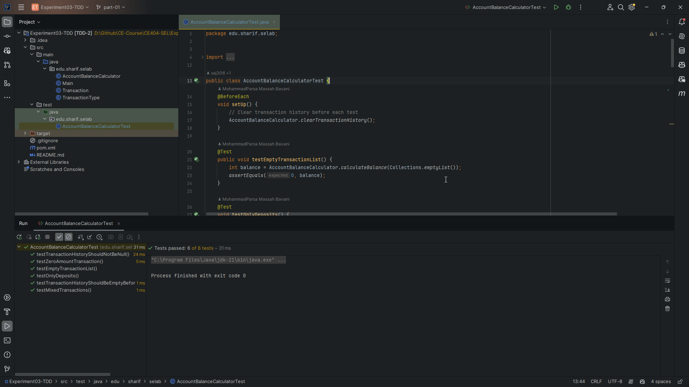
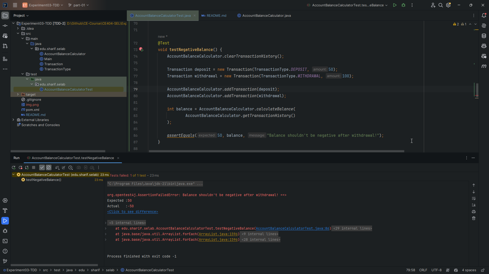
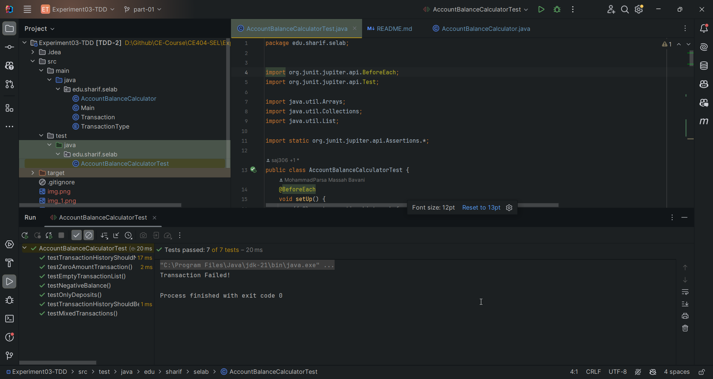
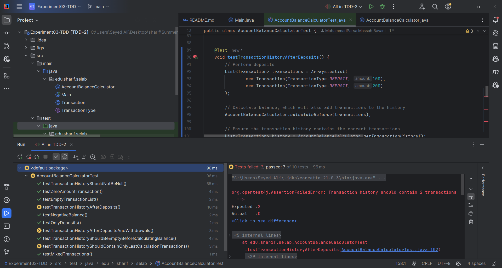
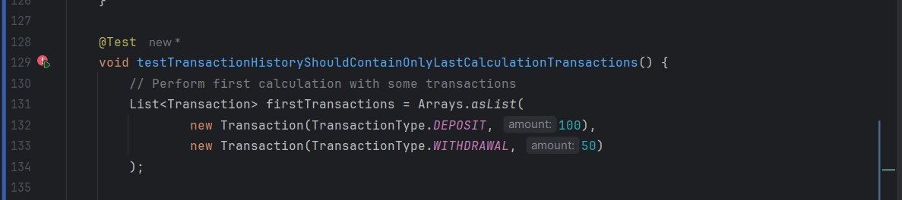
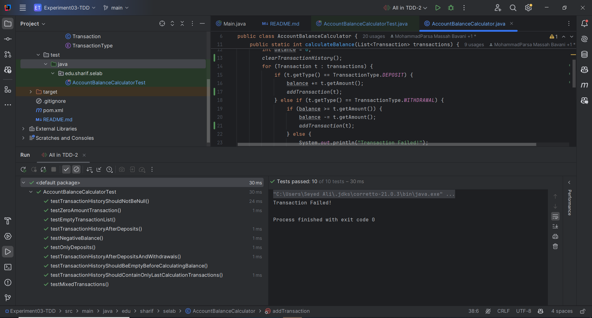

# مدیریت حساب بانکی

## بخش اول - کشف خطا

ابتدا برنامه را دانلود می‌کنیم و تست‌ها را داخل
`intellij`
اجرا می‌کنیم.
می‌بینیم که در ابتدا تمامی آزمون‌ها پاس می‌شوند و مشکلی وجود ندارد.



### پرسش اول - در این کد چه خطایی وجود دارد؟ و به نظر شما چرا دیده نشده‌است؟

در این کد اجازه داده می‌شود تا حتی وقتی که موجودی حساب کمتر از میزان مورد نیاز است، همچنان برداشت از حساب انجام شود و
عملا موجودی حساب در بعضی وقت‌ها می‌تواند منفی شود.
این موضوع داخل تست‌ها بررسی نشده است. پس به همین دلیل تمامی تست‌ها پاس می‌شوند.

### پرسش دوم - پس از یافتن خطا، یک آزمون برای آن بنویسید که منجر به کشف آن خطا شود. سپس آن را به گونه‌ای اصلاح کنید که آن مورد آزمون، پاس شود.

ابتدا تست زیر را اضافه می‌کنیم:

```JAVA

@Test
void testNegativeBalance() {
    AccountBalanceCalculator.clearTransactionHistory();

    Transaction deposit = new Transaction(TransactionType.DEPOSIT, 50);
    Transaction withdrawal = new Transaction(TransactionType.WITHDRAWAL, 100);

    AccountBalanceCalculator.addTransaction(deposit);
    AccountBalanceCalculator.addTransaction(withdrawal);

    int balance = AccountBalanceCalculator.calculateBalance(
            AccountBalanceCalculator.getTransactionHistory()
    );

    assertEquals(50, balance, "Balance shouldn't be negative after withdrawal!");
}
```

نتیجه بعد از اجرای تست:



حال کد را اصلاح می‌کنیم:


سپس مجددا تست‌ها را اجرا می‌کنیم و می‌بینیم که تمامی تست‌ها پاس می‌شوند:



### پرسش سوم - به‌نظر شما و بر اساس تجربه‌ی به‌دست آمده، نوشتن آزمون پس از نوشتن برنامه، چه مشکلاتی را می‌تواند بسازد؟

نوشتن آزمون بعد از توسعه کد ممکن است باعث شود برخی خطاهای احتمالی نادیده گرفته شوند. برنامه‌نویس گاهی ناخواسته تست‌هایی می‌نویسد که صرفا صحت کد را تأیید می‌کند، نه اینکه به‌دنبال کشف ایراد باشد. در نتیجه اشکالات منطقی ممکن است مدت‌ها پنهان بمانند و بعدها خطاهای جدی ایجاد کنند. مثلا در همین مثال، سناریوی موجودی منفی نه‌تنها کد اشتباه داشت، بلکه تستی هم برای تأیید آن نوشته شده بود و با گذر موفق این تست‌ها، یک خطای خطرناک می‌توانست با اطمینان کامل وارد سیستم شود.

## بخش دوم - به کارگیری TDD

در این بخش، با رویکرد TDD برای متد AccountBalanceCalculator چند تست اولیه نوشته شده است که در ابتدا fail می‌شوند.



در ادامه متوجه شدیم که یکی از مشکلات این است که نیاز است هنگامی که محاسبه موجودی صورت می‌گیرد، تراکنش محاسبه شده، در لیست تراکنش ها به کمک تابع **addTransaction** قرار بگیرد.

از طرفی چون دونوع مختلف از تراکنش را داریم، در صورت موفقیت‌آمبز بودن هرکدام از آنها، با استفاده از تابع گفته شده، تراکنش مربوطه را اضافه می‌کنیم.

کد تغییر یافته محاسبه موجودی به صورت زیر است:

```JAVA
public static int calculateBalance(List<Transaction> transactions) {
    int balance = 0;
    for (Transaction t : transactions) {
        if (t.getType() == TransactionType.DEPOSIT) {
            balance += t.getAmount();
            addTransaction(t);
        } else if (t.getType() == TransactionType.WITHDRAWAL) {
            if (balance >= t.getAmount()) {
                balance -= t.getAmount();
                addTransaction(t);
            } else {
                System.out.println("Transaction Failed!");
            }
        }
    }
    return balance;
}
```

بعد از این تغیرات، دو تست کیس، پاس شدند. اما تست‌کیس آخر هنوز پاس نشده است.



پس از بررسی این تست‌کیس متوجه شدیم که نیازمندی دیگری اینجاست که نیاز است صرفا آخرین تراکنش‌های محاسبه شده، در تاریخچه موجود باشند.

برای برقرار کردن این موضوع از متد **clearTransactionHistory** در کلاس **AccountBalanceCalculator** استفاده کردیم:

```JAVA
public static int calculateBalance(List<Transaction> transactions) {
    int balance = 0;
    clearTransactionHistory();
    for (Transaction t : transactions) {
        if (t.getType() == TransactionType.DEPOSIT) {
            balance += t.getAmount();
            addTransaction(t);
        } else if (t.getType() == TransactionType.WITHDRAWAL) {
            if (balance >= t.getAmount()) {
                balance -= t.getAmount();
                addTransaction(t);
            } else {
                System.out.println("Transaction Failed!");
            }
        }
    }
    return balance;
}
```

سپس دوباره تست‌ها را اجرا می‌کنیم:



همانطور که مشاهده میشود، همه تست‌ها پاس شدند.

---
### پرسش چهارم:
**تأثیر نوشتن تست قبل از کدنویسی (TDD) بر فرآیند توسعه**

* **شفاف‌سازی نیازمندی‌ها**
  با نوشتن تست‌ها پیش از کدنویسی، محدوده و رفتار مورد انتظار سیستم از ابتدا مشخص شد و ابهام در فهم نیازمندی‌ها کاهش یافت.

* **تمرکز بر خروجی و رفتار سیستم**
  برنامه‌نویسی بر اساس TDD باعث شد از همان ابتدا تمرکز بر نتایج و رفتار نهایی باشد، نه صرفاً ساختار داخلی پیاده‌سازی.

* **ایجاد مسیر توسعه‌ی مرحله‌ای**
  تست‌های اولیه مانند یک نقشه‌ راه عمل کردند و فرآیند پیاده‌سازی به صورت تدریجی و هدفمند پیش رفت.

* **کاهش خطاهای پنهان**
  از آنجا که تست‌ها سناریوهای مختلف را پیش‌بینی کرده بودند، احتمال باقی ماندن خطاهای کشف‌نشده کاهش یافت.

* **آسان‌تر شدن اشکال‌زدایی**
  با اجرای تست‌ها پس از هر تغییر، محل دقیق بروز خطا سریع‌تر شناسایی شد.

* **پرهیز از بازنویسی گسترده**
  چون رفتار مورد انتظار از ابتدا تعریف شده بود، نیاز به تغییرات اساسی در ساختار کد بعد از اتمام کار کمتر شد.

* **افزایش سرعت اطمینان از صحت کد**
  وجود تست‌های آماده باعث شد پس از هر مرحله تغییر، بررسی صحت عملکرد بسیار سریع انجام شود.

* **کاهش هزینه‌های اصلاح**
  خطاها در همان مراحل ابتدایی کشف و اصلاح شدند که هزینه‌ی برطرف‌کردن آن‌ها کمتر از حالت پس از تکمیل کد بود.

* **تقویت طراحی ماژولار**
  نیاز به پاس‌کردن تست‌های مستقل، پیاده‌سازی را به سمت طراحی ماژولار و قابل تست سوق داد.

* **تسهیل نگهداری و توسعه آتی**
  مجموعه تست‌های موجود به عنوان یک ابزار مستمر برای بررسی صحت عملکرد در تغییرات آینده باقی ماند.

* **مقایسه با روش قبلی (تست بعد از کدنویسی)**
  در روش قبلی احتمال جاافتادن برخی سناریوها بیشتر بود، رفع باگ‌ها دشوارتر انجام می‌شد و مسیر توسعه کمتر شفاف بود، در حالی که TDD این مشکلات را به میزان زیادی کاهش داد.

### پرسش پنجم: در نهایت به نظر شما، روش ایجاد مبتنی بر آزمون، چه مزایا و معایبی دارد؟ لطفاً بر اساس تجربه‌ی به‌دست‌آمده در این آزمایش به این سوال پاسخ دهید (این سوال پاسخ صحیح مشخصی ندارد).

#### **مزایا (Advantages)**

- **افزایش اطمینان و کاهش خطاها:** همان‌طور که در بخش اول آزمایش دیده شد، وجود تست‌های اولیه به تنهایی ضامن بی‌نقص بودن کد نیست. اما وقتی برای خطای کشف‌شده یک تست مشخص نوشتیم و سپس کد را اصلاح کردیم، اطمینان پیدا کردیم که آن خطای خاص برطرف شده و با اجرای مجدد سایر تست‌ها، مطمئن شدیم که تغییرات ما باعث ایجاد خطای جدیدی (Regression) نشده است.

- **طراحی بهتر و شفاف‌تر کد:** در بخش دوم، مجبور شدیم ابتدا برای قابلیتی که وجود نداشت (دریافت تاریخچه تراکنش‌ها) تست بنویسیم. این کار ما را وادار کرد که پیش از نوشتن کد اصلی، به این فکر کنیم که این قابلیت چگونه باید فراخوانی شود و خروجی آن چه شکلی داشته باشد. این تفکر از دیدگاه "مصرف‌کننده کد"، به طراحی یک API تمیزتر و منطقی‌تر برای کلاس `AccountBalanceCalculator` منجر شد.

- **مستندسازی زنده و اجرایی:** تست‌های نوشته‌شده، به‌ویژه تست‌های بخش دوم، مانند یک مستند دقیق عمل می‌کنند. هر کسی با خواندن این تست‌ها می‌تواند به‌سرعت بفهمد که کلاس مورد نظر چه قابلیت‌هایی دارد و هر متد در چه شرایطی چه رفتاری از خود نشان می‌دهد، بدون آنکه نیاز به خواندن کد اصلی داشته باشد.

- **تمرکز بر نیازمندی‌ها:** رویکرد TDD توسعه‌دهنده را مجبور می‌کند تا تنها کدی را بنویسد که برای پاس کردن تست فعلی لازم است. این امر از نوشتن کدهای اضافی و پیچیدگی‌های غیرضروری جلوگیری کرده و باعث می‌شود برنامه به‌صورت گام‌به‌گام و متمرکز بر نیازمندی‌ها توسعه یابد.

#### **معایب (Disadvantages)**

- **کندی اولیه در فرآیند توسعه:** نوشتن تست پیش از نوشتن کد، به خصوص در ابتدای کار، می‌تواند فرآیند را کندتر کند. در بخش دوم، ابتدا زمان صرف نوشتن تست‌های fail شونده شد که در نگاه اول ممکن است کاری غیرمفید به نظر برسد. این "سربار اولیه" نیازمند تغییر ذهنیت توسعه‌دهنده است.

- **دشواری در تست کردن برخی بخش‌ها:** این آزمایش بر روی یک منطق تجاری ساده متمرکز بود که تست کردن آن آسان است. اما در پروژه‌های واقعی، تست کردن بخش‌هایی مانند رابط کاربری (UI)، ارتباط با دیتابیس یا سرویس‌های خارجی با رویکرد TDD می‌تواند بسیار پیچیده‌تر و چالش‌برانگیزتر باشد.

- **احتمال خطا در خود تست:** همان‌طور که در بخش اول دیدیم، تست‌های اولیه یک باگ را کشف نکردند. این نشان می‌دهد که کیفیت محصول نهایی به کیفیت تست‌ها وابسته است. اگر تست‌ها به‌درستی همه حالات مرزی (Edge Cases) را پوشش ندهند، TDD نیز نمی‌تواند کیفیت کد را تضمین کند و حس اطمینان کاذبی ایجاد می‌کند.
