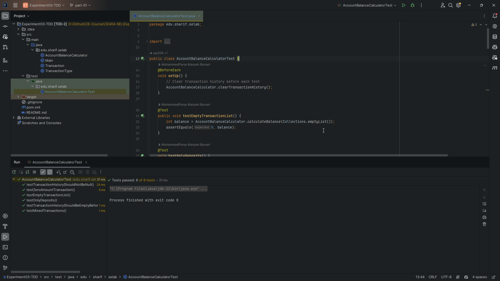
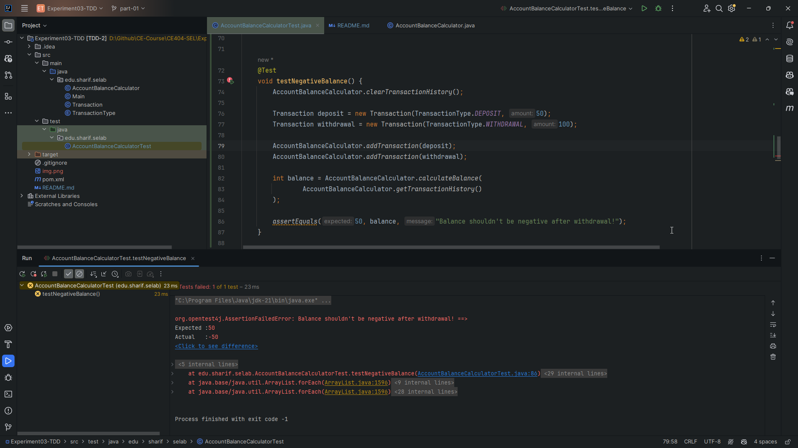
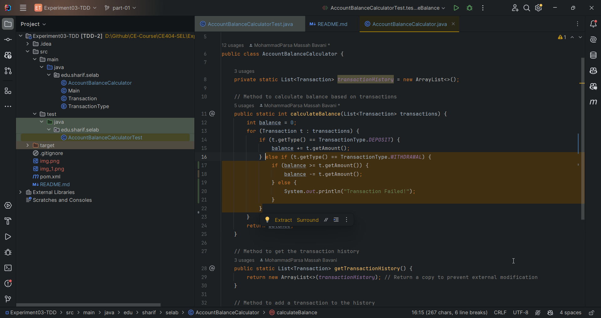
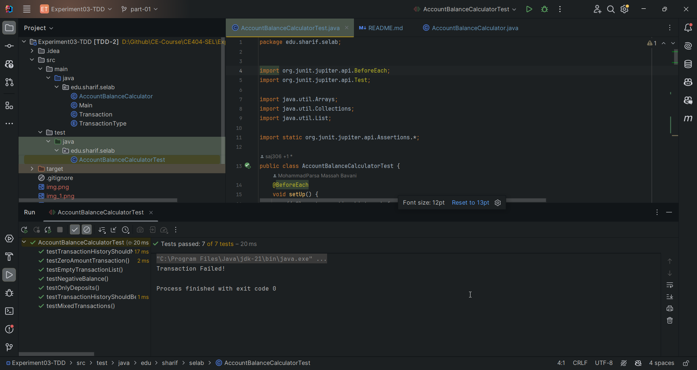

# مدیریت حساب بانکی

## بخش اول - کشف خطا

ابتدا برنامه را دانلود می‌کنیم و تست‌ها را داخل
`intellij`
اجرا می‌کنیم.
می‌بینیم که در ابتدا تمامی آزمون‌ها پاس می‌شوند و مشکلی وجود ندارد.



### پرسش اول - در این کد چه خطایی وجود دارد؟ و به نظر شما چرا دیده نشده‌است؟

در این کد اجازه داده می‌شود تا حتی وقتی که موجودی حساب کمتر از میزان مورد نیاز است، همچنان برداشت از حساب انجام شود و
عملا موجودی حساب در بعضی وقت‌ها می‌تواند منفی شود.
این موضوع داخل تست‌ها بررسی نشده است. پس به همین دلیل تمامی تست‌ها پاس می‌شوند.

### پرسش دوم - پس از یافتن خطا، یک آزمون برای آن بنویسید که منجر به کشف آن خطا شود. سپس آن را به گونه‌ای اصلاح کنید که آن مورد آزمون، پاس شود.

ابتدا تست زیر را اضافه می‌کنیم:

```JAVA

@Test
void testNegativeBalance() {
    AccountBalanceCalculator.clearTransactionHistory();

    Transaction deposit = new Transaction(TransactionType.DEPOSIT, 50);
    Transaction withdrawal = new Transaction(TransactionType.WITHDRAWAL, 100);

    AccountBalanceCalculator.addTransaction(deposit);
    AccountBalanceCalculator.addTransaction(withdrawal);

    int balance = AccountBalanceCalculator.calculateBalance(
            AccountBalanceCalculator.getTransactionHistory()
    );

    assertEquals(50, balance, "Balance shouldn't be negative after withdrawal!");
}
```

نتیجه بعد از اجرای تست:



حال کد را اصلاح می‌کنیم:



سپس مجددا تست‌ها را اجرا می‌کنیم و می‌بینیم که تمامی تست‌ها پاس می‌شوند:



